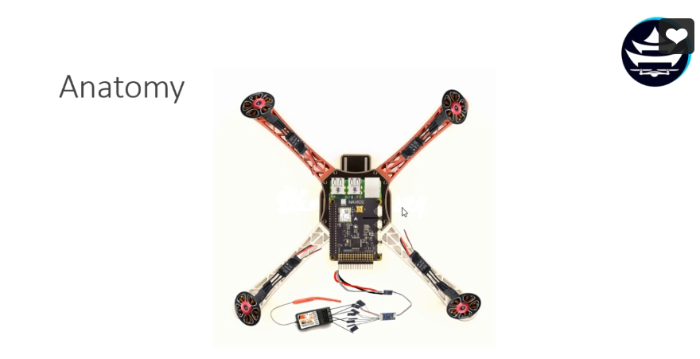
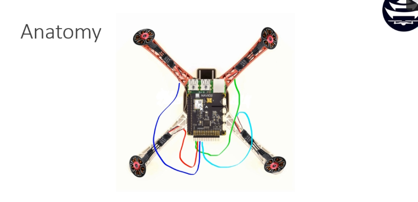
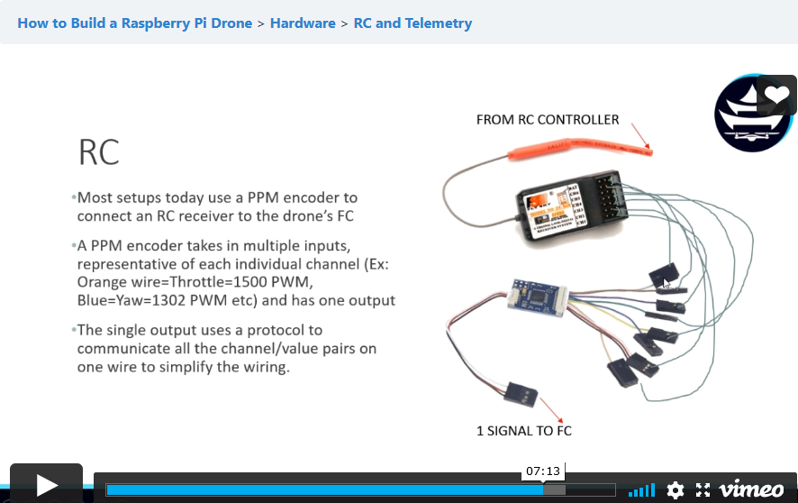

# Drone - Planning

## Paid Tutorial - Drone Dojo (99$)

Link to the course: https://dojofordrones.com/courses/how-to-build-a-raspberry-pi-drone/

## Components
* Motors (1000KV)
* Battery (LiPo, 2200MAh)
* Battery Connectors (Female / male / etc.)
* PM (Power distribution module)
* Flight Controller (FC, PixHawk Mini, contains firmware MC-based vs Linux-based)
* RC Receiver → PPM Encoder → RCIN on PixHawk → Main Out to 4 motors
* ESCs (Electronic Speed Controllers, x4, 30A, 5V3A, receives PWM signals)
* RC (Unidirectional, Receiver and controller)
* Telemetry (Bidirectional,  for a base station)
* Propellers (x4, length, pitch, current draw)
* Frame
* GPS / Optical flow (optionnal, needed for autonomous)

### PPM anatomy

## Bill Of Materials
* [PPM Encoder](https://www.amazon.ca/gp/product/B00HCA40HA/ref=ewc_pr_img_3?smid=A3OKQ1PMPIPWYS&psc=1)
* [Telemetry Modules](https://www.amazon.ca/gp/product/B01A8E8XWO/ref=ox_sc_act_title_2?smid=A1M51LMF2UUH8P&psc=1)
* [Power Module (T-Plug Type)](https://www.amazon.ca/gp/product/B077LRQ1PF/ref=ewc_pr_img_4?smid=A1XP3AYNGA5NKS&psc=1)