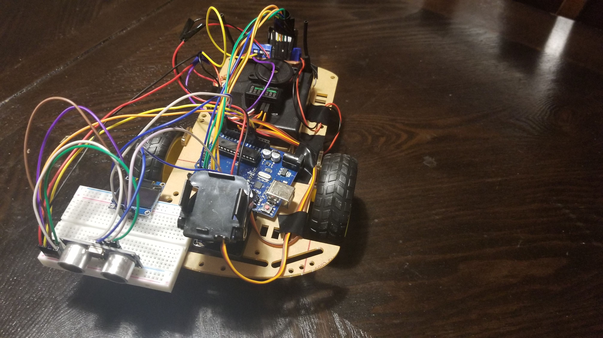

# Arduino Rover - Planning

## Components
* RC controller / receiver
* Servo motors
* H-Bridge
* Wheels
* OLED Display
* 

## Links
* [DroneBot Workshop - RC Robot Car](https://www.youtube.com/watch?v=BACBNgaCnJU)

## Bill of Materials
* [Infrared Night Vision Camera Module for Raspberry Pi](https://www.amazon.ca/gp/product/B07WMY1VQ6/ref=ox_sc_act_title_1?smid=A1ZS0R4YE7AG81&psc=1)